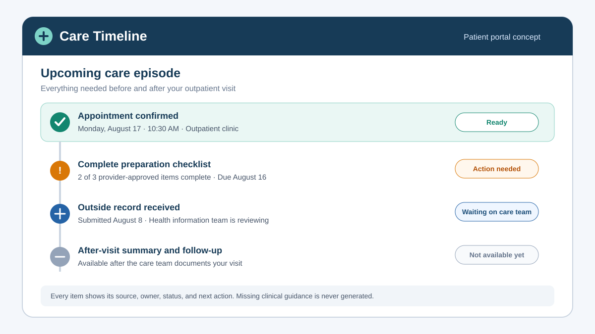
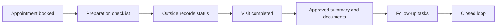

# Closing the Loop in Patient Portals

> A healthcare AI and product analytics case study exploring how patient portals can make care journeys easier to understand and complete.

**Portfolio project by Ajanee** · **Status: published case study** · **Not affiliated with or endorsed by Epic Systems**

## Executive summary

Patient portals give people access to appointments, results, messages, and visit information, but access alone does not guarantee task completion. Capabilities can vary by health system, specialty, visit type, and configuration. Patients may still have to piece together what happened, what is pending, and what to do next.

This case study proposes **Care Timeline**, a coordination layer for a MyChart-style portal. It brings together appointment status, preparation, outside-record status, visit documentation, approved after-care guidance, and follow-up tasks in one source-linked workflow.

AI is deliberately constrained. It can translate provider-approved content into plain language, organize tasks, and draft questions. It cannot diagnose, triage, recommend treatment, change the medical record, or invent instructions.

## The product question

> How might a patient portal turn fragmented information and partially self-service workflows into a closed loop where patients can see what happened, what is pending, and what they need to do next?

## Why this problem is worth exploring

- Self-scheduling can reduce staff effort and support after-hours access, but uptake and equitable access vary across populations and appointment types.
- Cross-organization exchange has improved, yet outside information is not always available at the point of care or incorporated into the clinician workflow.
- Immediate access to results and notes improves transparency, but access does not always mean comprehension.
- Structured task programs already exist in modern portal ecosystems, suggesting the opportunity is a coherent experience and consistent implementation—not a claim that every capability is absent.

See [Research and evidence](docs/research-and-evidence.md) for sources and confidence ratings.

## Proposed experience

Each item displays its owner, status, due date, and source. Missing clinical content is shown as missing or pending; the system does not generate it.

## MVP at a glance

1. A unified timeline spanning before, during, and after a visit.
2. Explicit states: **ready**, **action needed**, **waiting on care team**, **under review**, and **complete**.
3. Source-linked plain-language explanations for approved content.
4. Patient-controlled outside-record submission with review tracking.
5. Follow-up tasks and reminders tied to the care team's documented plan.
6. Question drafting and escalation paths when information is unclear.

Detailed scope: [MVP and backlog](docs/mvp-and-backlog.md)

## Visual case-study gallery

| Product and scope | Evidence and measurement |
|---|---|
| [Care Timeline prototype](assets/visuals/care-timeline-prototype.svg) | [Research validation matrix](assets/visuals/research-validation-matrix.svg) |
| [Conceptual architecture](assets/visuals/conceptual-architecture.svg) | [KPI framework](assets/visuals/kpi-framework.svg) |
| [MVP release path](assets/visuals/mvp-scope.svg) | |

All five visuals are stored as accessible, scalable SVG files so they remain readable on GitHub and can be reused in portfolio presentations.

## Measurement strategy

The primary outcome is the share of eligible care journeys in which all required patient and care-team tasks are completed by their due dates. Guardrails cover clinical safety, equity, privacy, and staff workload.

| Metric | Role |
|---|---|
| Closed-loop completion rate | North-star outcome |
| Patient task completion rate | Leading behavior |
| Self-service resolution rate | Access and efficiency |
| Clarification-contact rate | Comprehension proxy |
| Outside-record review cycle time | Workflow reliability |
| Unsupported-summary incident rate | AI safety guardrail |
| Completion-rate gap by access needs | Equity guardrail |

Definitions and experiment plan: [Metrics and measurement](docs/metrics-and-measurement.md)

## Repository guide

| Document | What it covers |
|---|---|
| [Case study](docs/case-study.md) | End-to-end product narrative |
| [Research and evidence](docs/research-and-evidence.md) | Claims, sources, confidence, and gaps |
| [MVP and backlog](docs/mvp-and-backlog.md) | Personas, stories, scope, prioritization, acceptance criteria |
| [Architecture](docs/architecture.md) | Conceptual system and data flow |
| [AI safety](docs/ai-safety.md) | Allowed uses, prohibited uses, and controls |
| [Metrics and measurement](docs/metrics-and-measurement.md) | KPI definitions, instrumentation, and experiment design |
| [Decision log](docs/decision-log.md) | Key choices and tradeoffs |
| [Portfolio kit](docs/portfolio-kit.md) | Resume, LinkedIn, and interview-ready language |
| [Visual assets](assets/visuals/) | Five portfolio-ready diagrams and prototype views |

## What this project demonstrates

Product analytics · healthcare product thinking · evidence synthesis · workflow design · MVP prioritization · KPI design · responsible AI scoping · risk management · portfolio communication

## Important limitations

This is a concept case study based on secondary research, not a production implementation or an evaluation of one health system's configuration. It uses no protected health information, clinical data, proprietary Epic materials, or patient-level dataset. Proposed metric targets are hypotheses to validate in discovery and pilot work, not measured results.

## Publication status

Ajanee approved this repository for public release on August 8, 2026. The completed [pre-publication checklist](REVIEW_CHECKLIST.md) records the review considerations used before release.
