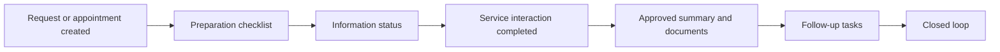

# Closing the Loop in Customer Portal Journeys

> A product analytics case study exploring how fragmented digital service workflows can become clearer, more measurable, and easier to complete.

**Portfolio project by Ajanee** · **Status: published case study** · **Public repo URL kept for continuity**

## Executive summary

Customer portals often give people access to messages, records, tasks, documents, and status updates, but access alone does not guarantee completion. People may still have to piece together what happened, what is pending, who owns the next step, and what action is needed.

This case study proposes **Care Timeline** as a broader coordination concept for portal-based service journeys. It brings status, preparation, source-linked information, handoffs, and follow-up tasks into one workflow so customers and teams can see the loop from request to resolution.

AI is deliberately constrained. It can summarize approved source material, organize tasks, draft questions, and clarify next steps. It cannot invent instructions, change source records, make autonomous decisions, or replace human review for high-impact actions.

## The product question

> How might a customer portal turn fragmented information and partially self-service workflows into a closed loop where people can see what happened, what is pending, and what they need to do next?

## Why this problem is worth exploring

- Self-service access can reduce operational strain, but only when people can complete the intended task.
- Cross-team handoffs often create unclear ownership, duplicate outreach, and status uncertainty.
- More information does not always mean better comprehension.
- The opportunity is a coherent experience with clear states, source links, and measurable completion.

See [Research and evidence](docs/research-and-evidence.md) for the original source review and confidence ratings.

## Proposed experience

Each item displays its owner, status, due date, and source. Missing or unreviewed content is shown as missing or pending; the system does not generate it.

## MVP at a glance

1. A unified timeline spanning before, during, and after a service interaction.
2. Explicit states: **ready**, **action needed**, **waiting on team**, **under review**, and **complete**.
3. Source-linked plain-language explanations for approved content.
4. Customer-controlled information submission with review tracking.
5. Follow-up tasks and reminders tied to documented next steps.
6. Question drafting and escalation paths when information is unclear.

Detailed scope: [MVP and backlog](docs/mvp-and-backlog.md)

## Visual case-study gallery

| Product and scope | Evidence and measurement |
|---|---|
| [Care Timeline prototype](assets/visuals/care-timeline-prototype.svg) | [Research validation matrix](assets/visuals/research-validation-matrix.svg) |
| [Conceptual architecture](assets/visuals/conceptual-architecture.svg) | [KPI framework](assets/visuals/kpi-framework.svg) |
| [MVP release path](assets/visuals/mvp-scope.svg) | |

## Measurement strategy

The primary outcome is the share of eligible journeys in which required customer and team tasks are completed by their due dates. Guardrails cover trust, privacy, fairness, unsupported automation, and staff workload.

| Metric | Role |
|---|---|
| Closed-loop completion rate | North-star outcome |
| Customer task completion rate | Leading behavior |
| Self-service resolution rate | Access and efficiency |
| Clarification-contact rate | Comprehension proxy |
| Information review cycle time | Workflow reliability |
| Unsupported-summary incident rate | AI safety guardrail |
| Completion-rate gap by access needs | Fairness guardrail |

Definitions and experiment plan: [Metrics and measurement](docs/metrics-and-measurement.md)

## Repository guide

| Document | What it covers |
|---|---|
| [Case study](docs/case-study.md) | End-to-end product narrative from the original concept |
| [Research and evidence](docs/research-and-evidence.md) | Claims, sources, confidence, and gaps |
| [MVP and backlog](docs/mvp-and-backlog.md) | Personas, stories, scope, prioritization, acceptance criteria |
| [Architecture](docs/architecture.md) | Conceptual system and data flow |
| [AI safety](docs/ai-safety.md) | Allowed uses, prohibited uses, and controls |
| [Metrics and measurement](docs/metrics-and-measurement.md) | KPI definitions, instrumentation, and experiment design |
| [Reproducibility and assumptions](docs/reproducibility-and-assumptions.md) | Evidence boundary, hypotheses, non-claims, and pilot validation plan |
| [Decision log](docs/decision-log.md) | Key choices and tradeoffs |
| [Portfolio kit](docs/portfolio-kit.md) | Resume, LinkedIn, and interview-ready language |
| [Visual assets](assets/visuals/) | Portfolio-ready diagrams and prototype views |

## What this project demonstrates

Product analytics · evidence synthesis · workflow design · KPI design · responsible AI scoping · risk management · portfolio communication

## Important limitations

This is a concept case study based on secondary research, not a production implementation or measured deployment. It uses no private customer data, proprietary system materials, or individual-level dataset. Proposed metric targets are hypotheses to validate in discovery and pilot work, not measured results. See [Reproducibility and assumptions](docs/reproducibility-and-assumptions.md) for the full evidence boundary and validation plan.

## Portfolio links

- [Live case study](https://ajaneeigharo.com/work/mychart-patient-portal)
- [Portfolio website](https://ajaneeigharo.com/)
- [Ajanee on LinkedIn](https://www.linkedin.com/in/ajaneeigharo/)
