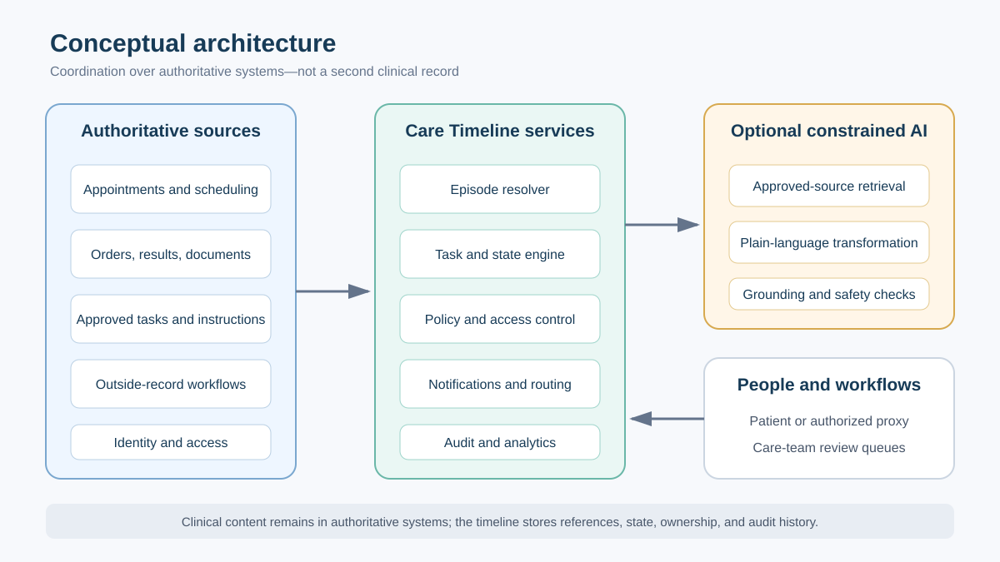
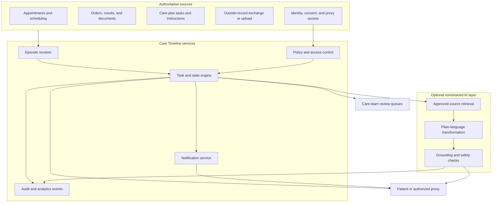
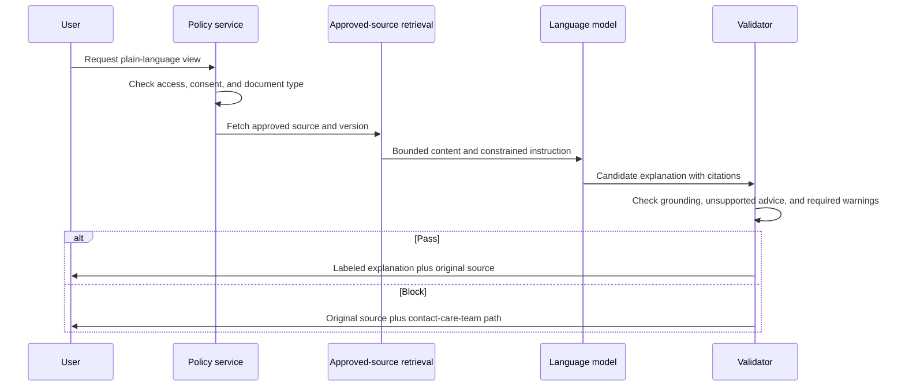

# Conceptual architecture

## Design goal

Create a coordination view over existing portal and clinical systems without becoming a second source of clinical truth.





## Component responsibilities

| Component | Responsibility | Must not do |
|---|---|---|
| Episode resolver | Associate approved objects with a care episode. | Merge ambiguous identities silently. |
| Task/state engine | Normalize workflow states and dependencies. | Infer new clinical instructions. |
| Policy layer | Enforce patient, proxy, sensitive-data, and organizational rules. | Broaden access for convenience. |
| AI layer | Restate retrieved approved content in plain language. | Diagnose, triage, recommend, or fill missing clinical facts. |
| Review queues | Route record and clarification work to the right team. | Promise a clinical response time without policy support. |
| Analytics | Measure product behavior and guardrails with minimum necessary data. | Store unrestricted clinical text in analytics events. |

## Core data object

A timeline item should minimally contain:

```text
item_id
episode_id
item_type
display_title
workflow_state
owner_type
source_system
source_object_id
source_updated_at
due_at (optional)
access_policy_reference
ai_transformation_status (none, pending, passed, blocked)
```

Clinical content stays in the authoritative source. The timeline stores references and presentation state wherever feasible.

## AI request flow



## Security and privacy principles

- Minimum necessary data in events, logs, prompts, and caches
- Encryption in transit and at rest
- Short retention for generated text unless explicitly saved under policy
- No model training on patient content without a separately authorized program
- Access checks at retrieval and display time
- Immutable audit trail for source version, prompt policy, model version, output, and disposition
- Threat modeling for prompt injection inside uploaded documents
- Vendor, HIPAA, consent, information-blocking, records-retention, and accessibility review before implementation

## Failure modes

| Failure | Safe behavior |
|---|---|
| Source unavailable or stale | Show unavailable/stale state and original location; do not summarize cached content as current. |
| Conflicting instructions | Show both authoritative sources, flag conflict, and route to the care team. |
| AI grounding check fails | Suppress explanation and show original content. |
| Outside record cannot be matched | Hold outside the chart, request correction, and show non-incorporated status. |
| Notification fails | Preserve in-product task state and retry within policy. |
| Proxy permission changes | Recheck at display time and remove access immediately. |
