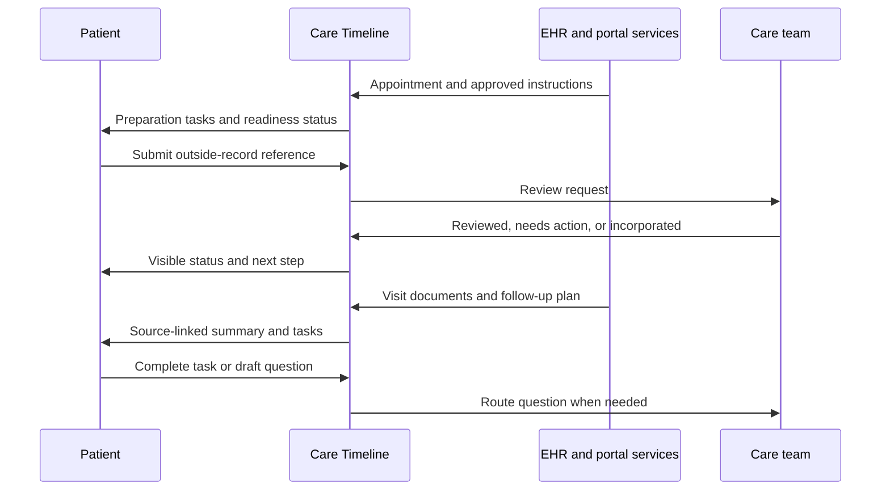

# Case study: closing the loop in patient portals

## Executive summary

**The opportunity is continuity, not feature novelty.** Patient portals may already offer scheduling, record exchange, notes, messaging, and care-plan tasks. The experience still breaks when those capabilities are inconsistently available, difficult to discover, or disconnected across a care episode.

**Care Timeline makes the state of care legible.** It presents a single view of completed events, pending dependencies, required actions, owners, due dates, and authoritative sources.

**AI supports comprehension without practicing medicine.** It explains only approved source material, preserves links to the original, signals uncertainty, and routes clinical questions to the care team.

## Context

Healthcare is a sequence of dependent tasks. A patient may need to prepare for an appointment, obtain an outside record, complete the visit, understand instructions, and schedule a follow-up. Today those steps may be distributed across appointments, messages, documents, results, and phone calls.

The core failure mode is not simply missing information. It is **unclear state**:

- What has happened?
- What is waiting on me?
- What is waiting on the care team?
- Which instruction is authoritative?
- When is the care episode actually complete?

## Users and needs

### Primary user

A patient managing routine outpatient care who wants to complete administrative and informational tasks without repeatedly calling the clinic.

### Important access contexts

- People with low digital or health literacy
- People using assistive technology
- People who prefer a language other than English
- Caregivers acting through authorized proxy access
- People with intermittent connectivity or limited time during business hours

### Jobs to be done

1. When I have an upcoming visit, help me know what to do and whether I am ready.
2. When an outside record is needed, show me how to share it and whether it was reviewed.
3. When a visit ends, show me the official documentation and next steps.
4. When instructions are difficult to understand, explain them without changing their clinical meaning.
5. When something is missing or unclear, help me contact the right team with the right context.

## Problem framing

The five original pain points were scheduling/cancellation, outside records, visit documentation, preparation instructions, and after-care expectations. Research supports the broader workflow problem, but the claims require nuance:

| Initial observation | Evidence-aware framing |
|---|---|
| Scheduling is not self-service | Self-scheduling exists, but availability and uptake vary by workflow and population. |
| Outside records cannot be integrated | Exchange tools exist, but completeness, incorporation, and review remain uneven. |
| Notes are not automatically available | Access has expanded; timing, document type, usability, and comprehension can still vary. |
| Preparation instructions are missing | Instructions may exist but can be fragmented, generic, late, or hard to locate. |
| After-care expectations are unclear | Access to summaries does not guarantee plain-language comprehension or completed follow-up. |

## Product concept

Care Timeline is an orchestration layer, not a new clinical record. It assembles references to existing authoritative objects and adds workflow state.

## Experience principles

1. **State before content:** show the task status, owner, and due date before adding more prose.
2. **Source before summary:** every explanation links to its approved source and timestamp.
3. **Missing means missing:** never fabricate absent instructions or infer a clinical plan.
4. **Human escalation is a feature:** uncertainty must have a clear route to the care team.
5. **Accessible by default:** plain language, screen-reader semantics, large touch targets, language support, and non-digital alternatives.
6. **No silent automation:** patients can see and control record-sharing and message-drafting actions.

## MVP journey

### Before the visit

- Show appointment status and allowed self-service actions.
- Present a checklist sourced from the care team.
- Identify missing forms or outside records.
- Let the patient submit a record or connect an available exchange source.

### After the visit

- Show when the visit is documented.
- Display provider-approved instructions and artifacts.
- Offer a plain-language view that preserves the original source.
- Turn documented follow-up into trackable tasks.
- Draft a clarification question when content is missing or confusing.

## Expected value

For patients, the concept reduces uncertainty and avoidable coordination work. For care teams, it aims to reduce preventable status calls and clarification messages while making unresolved tasks visible. For health systems, it creates measurable workflow outcomes rather than treating portal login as the end state.

These are hypotheses. A pilot would need to establish whether the experience improves completion without increasing clinical risk, staff workload, or disparities.

## Recommended next steps

1. Conduct 8–12 discovery interviews across patients, caregivers, schedulers, nurses, and health-information-management staff.
2. Map configuration and workflow variation across two specialties before locking MVP scope.
3. Prototype the timeline and test comprehension with low-fidelity tasks.
4. Validate event availability and denominator definitions with analytics and compliance partners.
5. Run a staged pilot with AI summarization disabled first, then add it behind clinician-approved source rules.

## Further questions

- Which task types generate the most avoidable patient contacts today?
- Which specialties have sufficiently structured instructions for a safe first pilot?
- How should proxy access and adolescent confidentiality affect the timeline?
- What completion gaps appear by language, disability, age, and portal access level?
- Which record-review states can be exposed without creating misleading expectations?

## Caveats

This concept has not been tested with users or implemented against Epic APIs. Organizational policy and configuration determine actual portal behavior. The design is not medical advice and does not replace clinical review.
