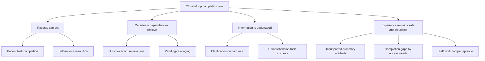

# Metrics and measurement

## Measurement principle

Measure whether patients complete care-navigation work safely and equitably—not whether they merely open the portal or click an AI feature.

## North-star metric

### Closed-loop completion rate

**Definition:** eligible care episodes in which every required patient task and every tracked care-team dependency reaches an accepted terminal state by its due date, divided by all eligible care episodes with at least one required task.

```text
closed-loop completion rate =
eligible episodes completed on time / all eligible episodes
```

Terminal states must be defined by workflow type. “Not clinically indicated” or “patient declined” may be valid terminal states; a hidden or abandoned task is not.

## KPI tree



## Metric dictionary

| Metric | Definition | Unit and denominator | Direction |
|---|---|---|---|
| Patient task completion rate | Required patient tasks reaching an accepted terminal state by due date | Tasks / eligible required patient tasks | Higher |
| Self-service resolution rate | Eligible actions completed without staff intervention | Episodes / episodes with an eligible action | Higher, with equity guardrail |
| Clarification-contact rate | Calls or messages about information already present in the episode | Contacts / 100 eligible episodes | Lower, but not at cost of access |
| Outside-record review cycle time | Time from confirmed receipt to recorded review disposition | Median hours; also P90 | Lower |
| Pending-task aging | Open tasks beyond their due date | Tasks / open tasks | Lower |
| Preparation completion | Required pre-visit tasks complete by cutoff | Visits / eligible visits | Higher |
| Follow-up completion | Documented follow-up actions complete within window | Actions / eligible actions | Higher |
| Unsupported-summary incident rate | AI outputs with any claim not entailed by the displayed source | Flagged outputs / audited AI outputs | Toward zero; release blocker threshold set clinically |
| Staff work per episode | Scheduler, nurse, or records-team touches attributable to the episode | Median touches or minutes / episode | Non-inferior or lower |
| Equity gap | Absolute difference in completion between reference and access-needs group | Percentage-point gap | Lower |

## Required cuts

Where legally and ethically appropriate, monitor by age band, preferred language, interpreter need, disability/accessibility setting, proxy use, portal access channel, insurance category, specialty, visit type, and digital-engagement history. Small-cell suppression and fairness review are required.

## Instrumentation plan

| Event | Required properties |
|---|---|
| `timeline_viewed` | episode type, item counts, access mode; no clinical text |
| `task_state_changed` | task type, prior state, new state, actor type, timestamps |
| `source_opened` | source type, item type, AI view active or not |
| `ai_explanation_requested` | approved document type, language, policy version |
| `ai_explanation_blocked` | reason category, model and policy versions |
| `clarification_started` | item type, route, AI draft used or not |
| `outside_record_status_changed` | prior/new state, elapsed time, actor type |
| `support_channel_selected` | phone, message, interpreter, accessibility support |

Do not put names, free-text clinical content, document text, or raw message bodies into product analytics events.

## Evaluation plan

### Phase 0: baseline

Observe 4–8 weeks of current workflow. Validate event completeness against operational systems and manually audit a sample of episode outcomes.

### Phase 1: deterministic timeline pilot

Use a stepped or randomized rollout where operationally appropriate. Compare closed-loop completion, clarification contacts, staff work, preparation completion, and equity gaps. Predefine eligibility, exclusions, time windows, and stopping rules.

### Phase 2: AI explanation pilot

Randomize eligible timeline users to original content versus original plus optional source-linked explanation. Primary comprehension should be measured with task-based questions, not satisfaction alone. Audit a stratified sample of every supported document type and language.

## Guardrails and stopping criteria

- Pause the affected AI workflow for any high-severity unsupported clinical instruction.
- Stop expansion if staff work materially increases beyond the pre-agreed non-inferiority margin.
- Investigate if completion improves overall while a priority access group's gap worsens.
- Treat falling clarification contacts as ambiguous until comprehension and safety remain stable.
- Do not use invented targets as evidence of impact; set thresholds with clinical, compliance, operational, and patient partners.

## Analysis cautions

Portal users are not representative of all patients. Adoption, workflow eligibility, seasonality, specialty mix, and concurrent operational changes can confound before/after comparisons. Report intention-to-treat and treatment-on-treated views when appropriate, preserve denominators, and pair aggregate results with equity cuts.
