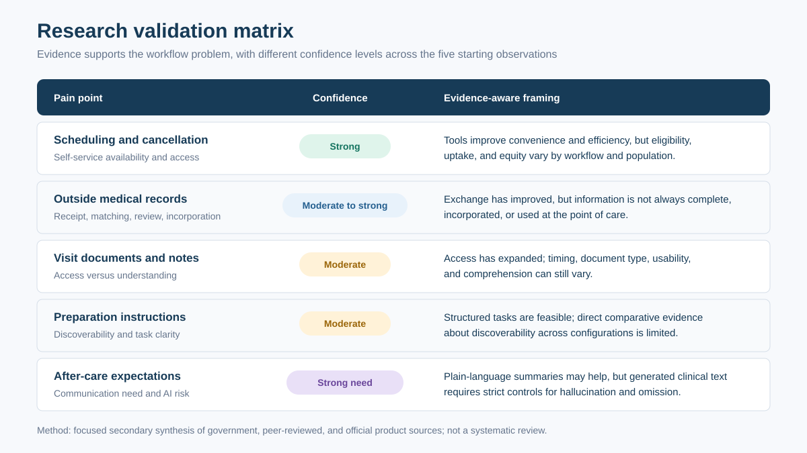

# Research and evidence

## Research question

Do the five observed patient-portal pain points reflect broader problems, and what product implications are defensible from current evidence?

## Method

This is a focused secondary-research synthesis, not a systematic review. Sources were prioritized in this order: government and standards material, peer-reviewed research, and official product documentation. Product documentation establishes capability, not universal availability or outcomes. Personal experience informed the initial questions but is not treated as generalizable evidence.

## Evidence summary

| Area | Confidence | Evidence-based interpretation | Product implication |
|---|---|---|---|
| Scheduling and cancellation | Strong | Self-service tools can improve convenience and efficiency, but uptake, eligibility, and equity vary. | Expose eligible actions, explain why an action is unavailable, and preserve phone/accessibility alternatives. |
| Outside records | Moderate to strong | National exchange has improved, but outside information is not always complete or used at the point of care. | Track submission, matching, review, and incorporation as separate states. |
| Visit documents and notes | Moderate | Regulation and portal functionality expand access, but timing and comprehension vary. | Show document availability and provenance; distinguish access from understanding. |
| Preparation instructions | Moderate | Digital pre-check-in and structured tasks are feasible; direct evidence about discoverability across portal configurations is limited. | Use one checklist with source, owner, due date, and escalation path. |
| After-care expectations | Strong for communication need; moderate for this solution | Patient-friendly summaries can support comprehension, but AI-generated clinical text can omit or hallucinate information. | Summarize only approved content, link every claim, and require safe fallback to the original and care team. |

## Finding 1: self-service scheduling is valuable but uneven

A Mayo Clinic study found that 29.5% of self-scheduling activity occurred outside normal staff hours and that self-scheduled appointments more often finalized in one step. A large multispecialty practice later documented seven distinct self-scheduling processes rather than one universal flow. Research also found lower uptake among some older, non-English-speaking, and minoritized populations.

**Implication:** the design should not assume that every visit can be booked, changed, or cancelled online. It should make eligibility and alternatives visible, and measure outcomes by access needs rather than only aggregate adoption.

## Finding 2: exchange capability does not guarantee closed-loop review

Epic's Share Everywhere allows a patient to grant temporary access to a subset of MyChart information. ONC's 2023 hospital interoperability brief reports broad access to outside electronic information, but fewer than half of hospitals said clinicians often used outside information at the point of care. Sending, receiving, finding, integrating, and actually reviewing information are different workflow stages.

**Implication:** a single “uploaded” label is insufficient. Patients need status states such as received, identity matched, under review, needs action, incorporated, or not incorporated—with careful wording that does not imply clinical acceptance.

## Finding 3: access is not the same as comprehension

Immediate electronic release of results and notes improves transparency. Recent national survey analysis found that many patients view results before speaking with a clinician and that reported understanding varies with digital literacy and provider encouragement.

**Implication:** preserve immediate access while adding plain-language, source-linked support and a low-friction route to ask a question. Do not delay or overwrite the original document.

## Finding 4: structured tasks exist, but coherence is the opportunity

Epic documentation describes Care Companion tasks and patient education. This supports the feasibility of structured patient work, while also weakening any claim that MyChart has no task functionality.

**Implication:** the differentiated concept is a coherent cross-episode timeline with explicit ownership and completion—not a generic checklist.

## Finding 5: AI summarization needs strict controls

Clinical summarization research shows promise, but an evaluation of generated emergency-department discharge summaries found hallucinations and clinically relevant omissions even when many summaries were otherwise accurate. A broader review of patient-facing generative AI highlights risks including oversimplification, lower accuracy on complex questions, weak source transparency, privacy, and equity concerns.

**Implication:** AI output must be secondary to provider-approved source content, traceable, monitored, and excluded from diagnosis, triage, treatment recommendation, and autonomous record updates.

## Sources

Accessed August 8, 2026.

1. North F, et al. [Impact of Web-Based Self-Scheduling on Finalization of Well-Child Appointments](https://pubmed.ncbi.nlm.nih.gov/33734095/). *JMIR Medical Informatics*, 2021.
2. North F, et al. [Patient Opportunities to Self-Schedule in a Large Multisite, Multispecialty Medical Practice](https://pubmed.ncbi.nlm.nih.gov/39185323/). *Mayo Clinic Proceedings: Innovations, Quality & Outcomes*, 2024.
3. Chung S, et al. [An EHR-Based Automated Self-Rescheduling Tool to Improve Patient Access](https://pubmed.ncbi.nlm.nih.gov/38502159/). *JMIR Medical Informatics*, 2024.
4. Liao JM, et al. [Impact of Patient Portal-Based Self-Scheduling of Diagnostic Imaging Studies on Health Disparities](https://pubmed.ncbi.nlm.nih.gov/36063414/). *Journal of the American College of Radiology*, 2022.
5. Epic Systems. [Share Everywhere FAQ](https://shareeverywhere.epic.com/FAQ).
6. Office of the National Coordinator for Health IT. [Interoperable Exchange of Patient Health Information Among U.S. Hospitals: 2023](https://www.healthit.gov/sites/default/files/2024-05/Interoperable-Exchange-of-Patient-Health-Information-Among-U.S.-Hospitals-2023.pdf).
7. Office of the National Coordinator for Health IT. [Individuals' Access and Use of Patient Portals and Smartphone Health Apps, 2022](https://www.healthit.gov/sites/default/files/2023-10/DB69_IndividualsAccess-UsePatientPortals_508.pdf).
8. Epic Systems. [MyChart Care Companion task data specification](https://open.epic.com/EHITables/GetTable/TASK_PATIENT_ACTIVITY.htm).
9. Richwine C, et al. [Patient-Reported Experiences With Viewing and Understanding Test Results in Patient Portals](https://pubmed.ncbi.nlm.nih.gov/42285046/). *Journal of Medical Internet Research*, 2026.
10. Kim H, et al. [Patient-Friendly Discharge Summaries in Korea Based on ChatGPT](https://pubmed.ncbi.nlm.nih.gov/38685890/). *Journal of Korean Medical Science*, 2024.
11. JAMA Network Open study. [Evaluating Large Language Models for Drafting Emergency Department Discharge Summaries](https://pubmed.ncbi.nlm.nih.gov/38633805/), 2024.
12. Parker JL, et al. [Generative AI/LLMs for Plain Language Medical Information](https://pubmed.ncbi.nlm.nih.gov/40771655/). Review, 2025.

## Research gaps

- Direct comparative evidence on instruction discoverability across health-system MyChart configurations
- Patient and staff interviews tied to a specific specialty workflow
- Baseline rates for clarification contacts, record-review cycle time, and incomplete follow-up
- Usability testing with low-literacy, multilingual, caregiver, and assistive-technology users
- Legal and operational review of proxy access, adolescent confidentiality, and sensitive-note handling
